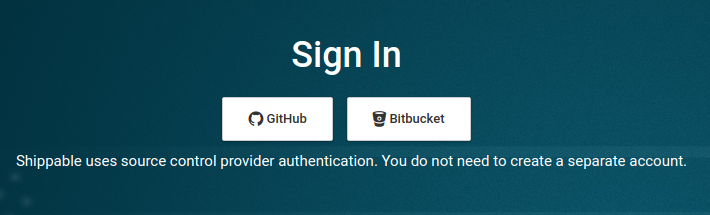
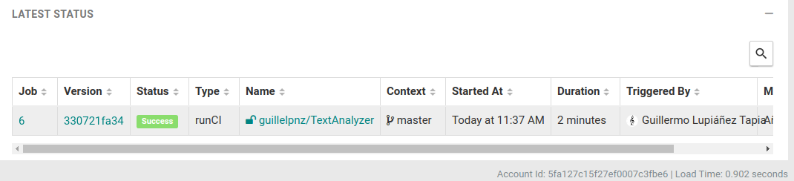

# TextAnalyzer

## Descripción

El proyecto consiste en una API REST programada en [Go](https://golang.org/) que revisa textos de todo tipo, pudiendo encontrar así redundancias en ellos, o hacer estadísticas sobre el uso del lenguaje en diferentes discursos. (Posiblemente acabe resolviendo algunos, ofreciendo sinónimos). El paquete principal del proyecto está [aquí](src/texto).

## Justificación de una nueva herramienta: golangci-lint

[golangci-lint](https://github.com/golangci/golangci-lint) ejecuta linters en
paralelo, y lo hace 5 veces más rápido que por ejemplo: gometalinter. Además,
vscode, el entorno en el que estoy desarrollando la aplicación, lo tiene integrado.
Esto hace que no tenga que preocuparme porque mi linter de vscode y el linter
que usa la integración continua analicen la sintaxis de manera distinta.

## Integración continua funcionando y correcta justificación de la misma

Los ejercicios 9 y 10 contienen los pasos que seguí para llevar a cabo la integración continua con TravisCI.

[Fichero de ejercicios del tema](https://github.com/guillelpnz/Ejercicios/blob/master/TDD.md)

## Configuración de algún sistema de integración continua adicional (justificado de la misma forma)

Decidí configurar Shippable, es un proceso muy parecido al de TracisCI. Primero hay que darle acceso a Shippable a nuestro repositorio de GitHub

Una vez ahí, hay que autorizar a Shippable, al igual que hicimos con Travis.
Posteriormente, activar nuestro repositorio dentro de los que queremos que se
testeen cuando se hace push.

Lo siguiente es crear un archivo con el nombre: .shippable.yml

En mi caso he usado make directamente (en Travis usé un container de Docker)
para ejecutar los tests. Este es mi fichero:

Como vemos cubrimos varias versiones de Go, al igual que en Travis, e instalamos el linter para luego ejecutar linter y test

- Funcionamiento correcto:

## Uso correcto del gestor de tareas en todos los casos anteriores

El gestor de tareas lo he utilizado tanto en el Dockerfile
(usado por .travis.yml) como en .shippable.yml (usado directamente)

## Aprovechamiento del contenedor de Docker

El contenedor de Docker lo aprovechamos en TravisCI, que hace uso del
Dockerfile.

<!-- ## Elección del contenedor base

Como contenedor base he elegido golang:alpine3.12. He tomado esta decisión porque
en velocidad no había una diferencia significativa golang:latest,
golang:alpine y golang:1.15.3-alpine. En cuanto al espacio,
todos los golang:alpine pesan cerca de 300mb, mientras que golang:latest pesa más
de 800mb. Estas fueron las [pruebas de velocidad que hice](https://github.com/guillelpnz/TextAnalyzer/blob/master/docs/pruebas_velocidad.md)

## Dockerfile correcto

[Dockerfile del proyecto](https://github.com/guillelpnz/TextAnalyzer/blob/master/Dockerfile)

## Uso de GitHub Container Registry

[Paquetes](https://github.com/guillelpnz?tab=packages)

## Docker Hub

[Container](https://hub.docker.com/r/guillelpnz/textanalyzer/tags)

Para que se construya automáticamente, hay que conectar GitHub a Docker Hub mediante un OAUTH. Posteriormente, acceder al apartado Manage Repository/Builds/Configure Automated Builds y ahí activar la pestaña: autobuild. -->

<!-- ## Motivación

Durante el trayecto que llevo recorrido de carrera, he tenido que hacer numerosas documentaciones, exposiciones, explicaciones, etc. Esto hizo que me diera cuenta de que paso bastante tiempo revisando si uso palabras de manera redundante. Por lo que se me ocurrió esta pequeña API que facilita el trabajo de analizar textos. -->

<!-- ## Uso de la aplicación

1. Para poder hacer uso de TextAnalyzer debes previamente
[instalar](https://golang.org/dl/) y [configurar](https://golang.org/doc/install)
Go correctamente en tu sistema.

2. Debes descargarte este repositorio.

- Para poder testear la aplicación, debes estar en el directorio raíz del
proyecto y ejecutar el comando:

&nbsp;&nbsp;&nbsp;&nbsp;&nbsp;&nbsp;&nbsp;&nbsp;&nbsp; `make test`

- Para ver las cabeceras de los métodos del paquete texto debes estar en el
directorio raíz del proyecto y ejecutar el comando:

&nbsp;&nbsp;&nbsp;&nbsp;&nbsp;&nbsp;&nbsp;&nbsp;&nbsp; `make doc`

## Herramientas utilizadas

El lenguaje que se va a utilizar es Go. Estas son el resto de [herramientas](docs/herramientas.md). -->

## Avance del código

[Carpeta con los fuentes hasta el momento](https://github.com/guillelpnz/TextAnalyzer/tree/master/src/texto)

## Archivo iv.yaml

[Fichero iv.yaml](iv.yaml)

## Issues cerrados

[Issues cerrados](https://github.com/guillelpnz/TextAnalyzer/issues?q=is%3Aissue+is%3Aclosed)

## Issues abiertos

[Issues abiertos](https://github.com/guillelpnz/TextAnalyzer/issues)
