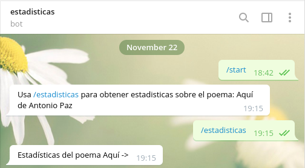
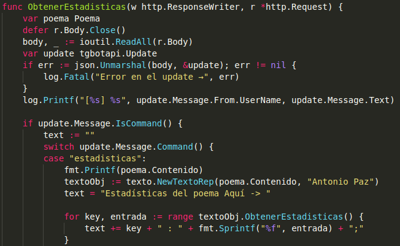
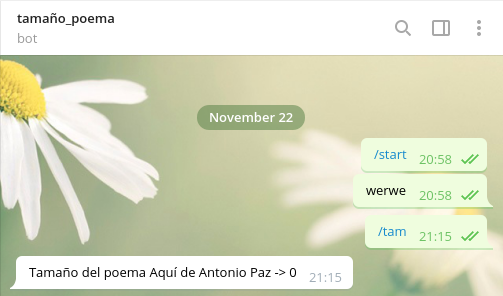
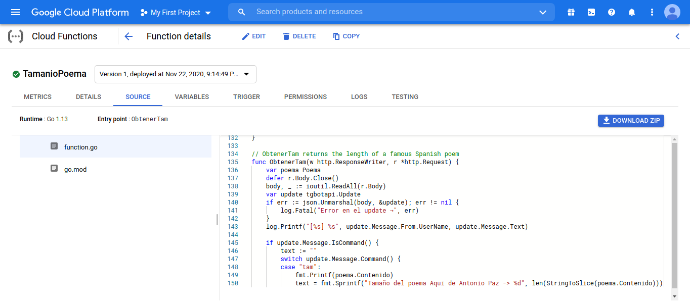

# Imágenes sobre los dos bots que intenté hacer

## Bot que devuelve estadísticas sobre un texto en memoria: [HU7]

Código:

Sospechaba que no funcionaba porque hacía uso de métodos de mi clase, y que no los estaba importando bien,
pero entonces hice el siguiente bot

## Bot que calcula el tamaño de un texto en memoria: [HU8]

Código:

Uso únicamente funciones testeadas (que no métodos) que declaro e implemento en el mismo archivo.
Aún así no funcionan.

En local funcionaba todo, en Google Cloud Functions nada.
