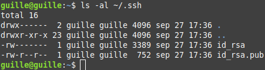
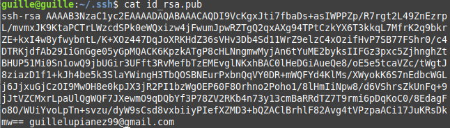
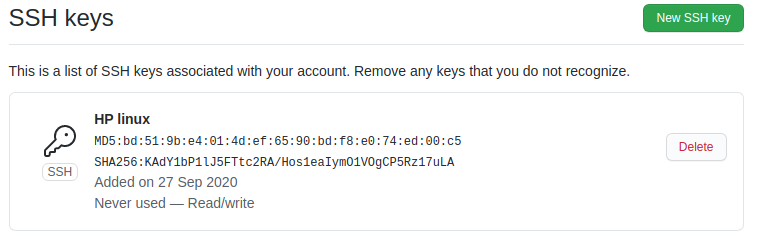

# Documentación del hito 0

El hito 0 trata sobre la puesta en marcha de las herramientas necesarias para el desarrollo de un proyecto. Se usa Git y Github. Hay que seguir los siguientes pasos:

## Configurar el nombre y correo en GitHub y en Git

Git ya configurado con nombre y correo:

## Añadir una clave pública a GitHub

Hay que crear un par de claves pública/privada y añadir la privada al agente ssh y la pública a GitHub:

Nos aparecerán dos archivos en el directorio .ssh, en mi caso:

Añadimos al agente ssh la clave privada:

Copiamos la clave pública

Y la pegamos en GitHub:

