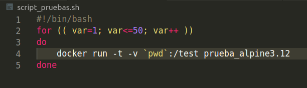
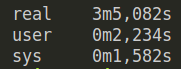
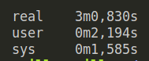
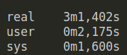
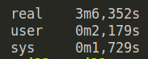

# Pruebas de velocidad de distintas imágenes

Estas son las pruebas que he hecho con distintas [imágenes oficiales de golang](https://hub.docker.com/_/golang?tab=tags).

Lo que he hecho para medir el tiempo ha sido usar la orden [time](https://man7.org/linux/man-pages/man1/time.1.html)
sobre la ejecución del siguiente script:

Por lo que los tiempos que obtenemos son 50 veces el tiempo de ejecución
de los tests. Hay que tener en cuenta que el tiempo del sistema también
se suma, por lo que esta medida sirve para comparar los resultados entre
sí, pero no para obtener conclusiones del tiempo que tardan por separado.
Estos han sido los resultados:

## golang:1.15.3-alpine

- Media: 3.70164 segundos

## golang:latest

- Media: 3.6166 segundos

## golang:alpine3.12

- Media: 3.62804 segundos

## golang:alpine

- Media: 3.72704 segundos
